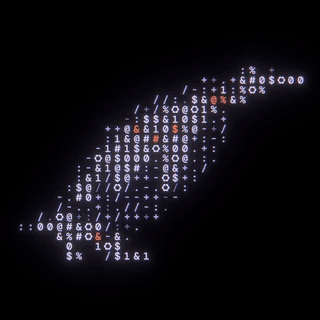

# Framework Penguin

Plymouth Boot Screen for Framework



A custom Plymouth boot screen theme featuring Framework's ASCII-art penguin animation.

This version includes LUKS disk encryption password entry UI based on the original bgrt default login (lock icon, entry box, and bullet characters for password masking).

## Credits

Animation sourced from Framework's ASCII penguin motion graphic.

## Installation

### Prerequisites

Ensure Plymouth is installed on your system:

**Fedora/RHEL:**
```bash
sudo dnf install plymouth plymouth-scripts
```

**Debian/Ubuntu:**
```bash
sudo apt install plymouth plymouth-themes
```

**Arch Linux:**
```bash
sudo pacman -S plymouth
```

### Install the Theme

1. Copy the theme to Plymouth's themes directory:
   ```bash
   sudo cp -r framework-penguin /usr/share/plymouth/themes/
   ```

2. Set the theme as default:
   ```bash
   sudo plymouth-set-default-theme -R framework-penguin
   ```

## Distro Logo

The default logo is fedora, but you can insert any logo by replacing the `watermark.png` image.

## Animation

The throbber is 101 frames (`throbber-0000.png` … `throbber-0100.png`) at 500x500, extracted
from a 1080x1080 / 24fps source. The source's ASCII border frame was cropped out with:

```
crop=1000:951:36:67,pad=1000:1000:0:24:black,scale=500:500
```

Plymouth's refresh callback fires at roughly 50Hz, so `framework-penguin.script` advances
the animation by `throbber_speed = 0.5` frames per refresh to play back at close to the
source's native 24fps. Raise or lower `throbber_speed` to speed up or slow down the loop.
